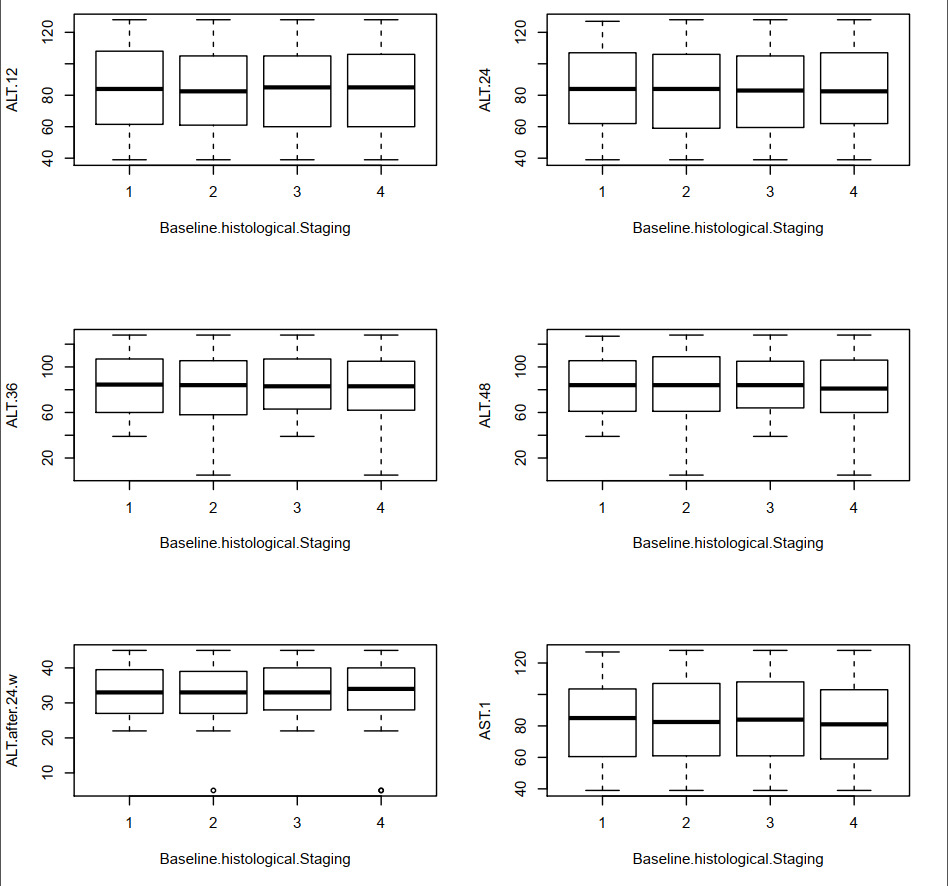
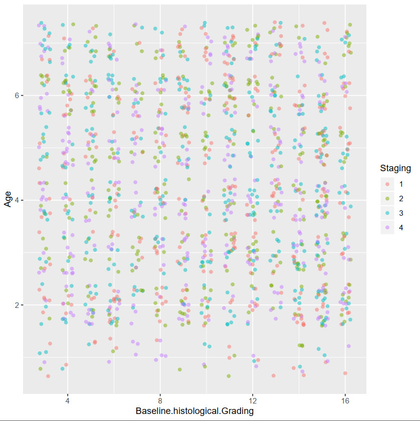

# Project Methodology

## Exploratory Data Analysis

### Data variation

Exploring patterns of variation, typical values and outliers is
an important task. We can gain such knowledge by visualizing the variables’ distributions. As shown below, we have used boxplots to quickly determine the relevance of features and their impact on the baseline histological grading of the patient.

## Data Preprocessing

### Discretization

Discretization is the process of transforming continuous
data into categorical data. The importance of discretization
is that it helps handling outliers by placing these values into
the lower or higher intervals together with the remaining inlying values of the distribution. Our discretization will be
handled by the file attached to the dataset.

### Feature Engineering & Selection
Via categorical variables encoding and numerical variables engineering and removing redundant features, then checking for correlated features. Dimensionality reduction will be handled by the MRMR method. As shown below, our feature selection process hasn't been able to select a certain future with a large impact on the baseline histological grading which is only natural due to the inherent balance of our utilized dataset.

For furher clarity, we have split the data by histological grading stage.

## Modeling
We have utilized both KNN and Naive Bayes for our models.

## Evaluation 

- We will attempt evaluation via the K-folds method.

- Should the first attempt prove unsatisfactory, we will resort to using the K-fold stratification method for enhanced accuracy. 